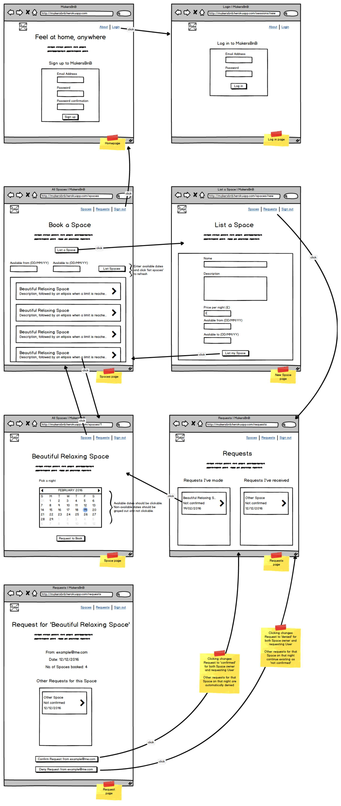
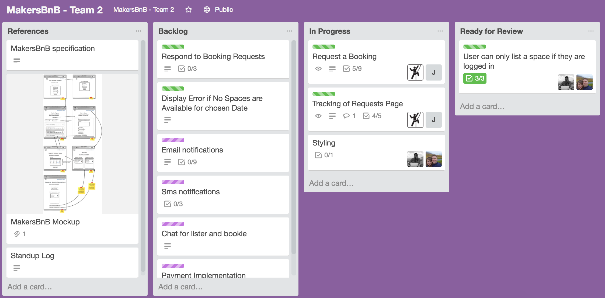
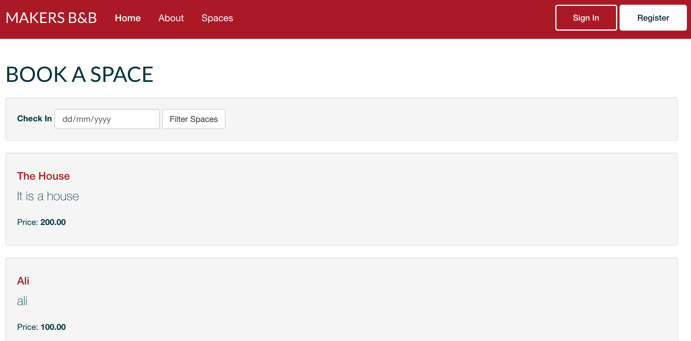
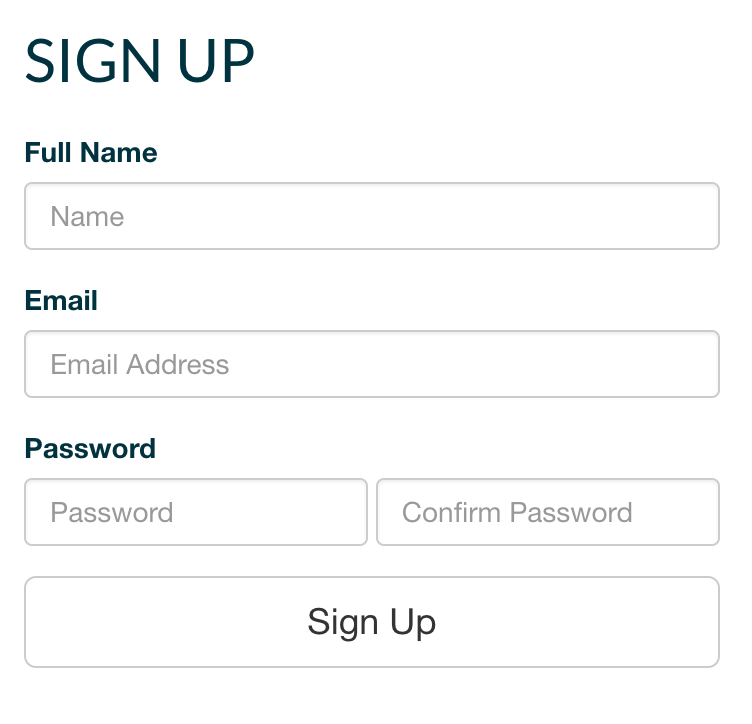
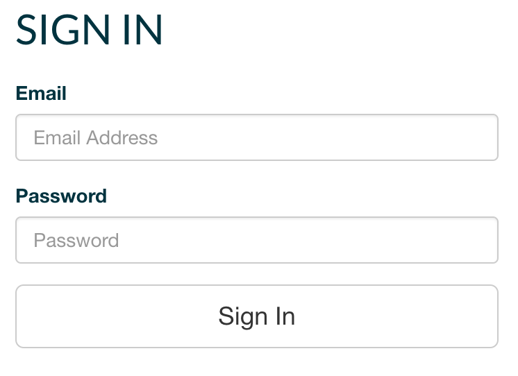
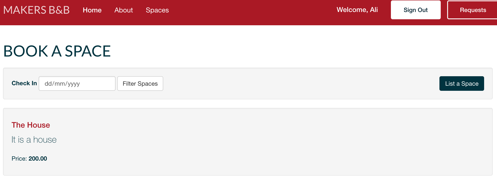
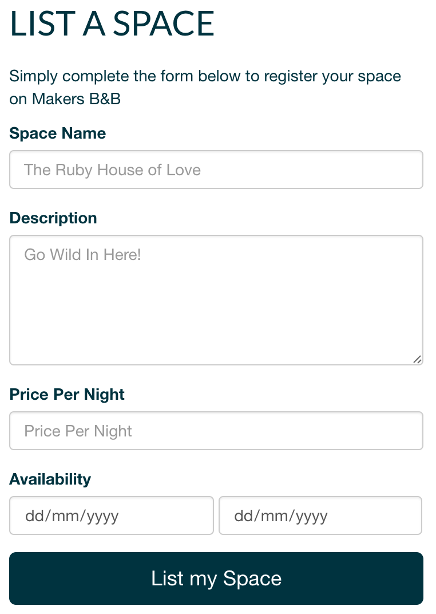
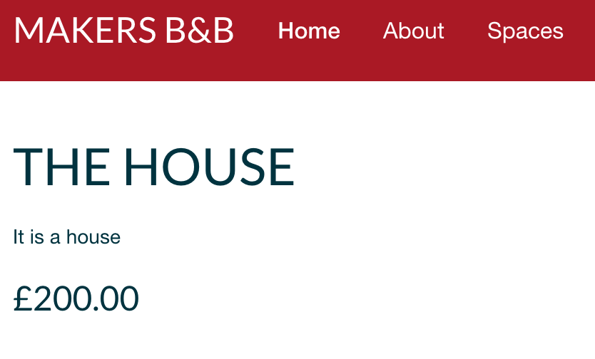

# Makers B & B

## Concept
### Headline specifications
[x] Any signed-up user can list a new space  
[x] Users can list multiple spaces  
[x] Users should be able to name their space, provide a short description of the space, and a price per night  
[x] Users should be able to offer a range of dates where their space is available  
[x] Any signed-up user can request to hire any space for one night, and this should be approved by the user that owns that space  
[ ] Nights for which a space has already been booked should not be available for users to book that space  
[ ] Until a user has confirmed a booking request, that space can still be booked for that night

## Product development
### App Flow Diagram
Makers were kind enough to give us a work flow diagram to work from.

### Trello
Agile methodologies were used. Particularly Scrum and Kanban. Below is the workboard we used to keep track of what tasks were required and who was working on them. 

## Product Screenshots
#### Landing Page

#### Registration

#### Login

#### Signed In

#### List A Space

#### Individual Property Page

